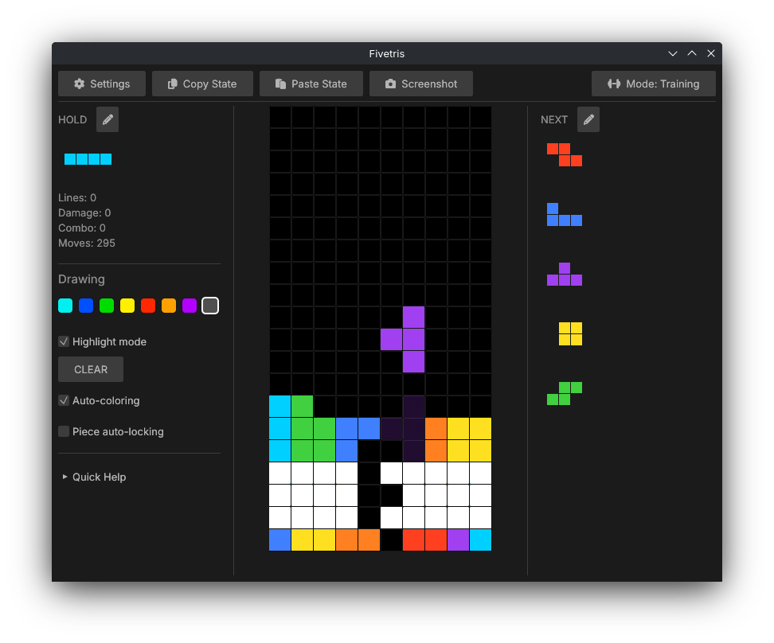
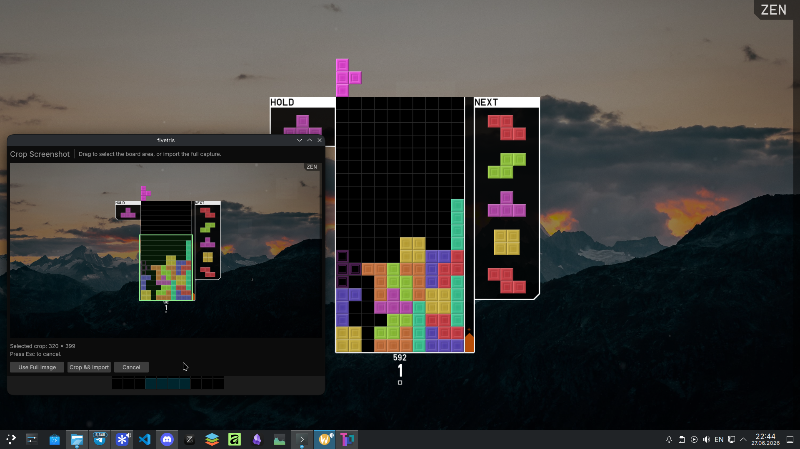
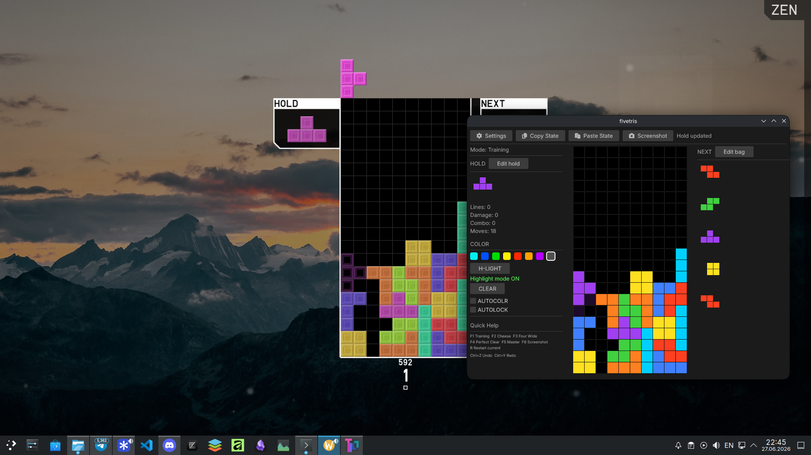

# fivetris
This is a Rust rewrite of [four-tris](https://github.com/fiorescarlatto/four-tris), an open source training tool for block-stacking games. You can simulate different situations, test options, and train freely in a Tetris-like environment.

# Download

You can download the latest release from the [releases page](https://github.com/relativemodder/fivetris/releases), or [try it out](https://relativemodder.github.io/fivetris/) in your browser.

You can draw pieces on the board and test different strategies

...and screenshot other Tetris-like games' board states.

## Reporting issues, suggestions, feedback, bugs

1. Open an issue in this repository if you are not sure whether something is a bug or expected behavior.
2. Check whether it has already been reported.
3. If not, describe the problem clearly and include the steps to reproduce it.

## Building
- You will need a recent stable Rust toolchain with cargo.
- On Linux, make sure the ALSA development package is installed so audio can build correctly.
- Run `cargo run` to start the application.

If you want to build the app into a standalone binary you can use `cargo build --release`.

## Original project

- <https://github.com/fiorescarlatto/four-tris>

## License

This project is licensed under the GNU General Public License v3.0 or later. See [LICENSE](./LICENSE).
